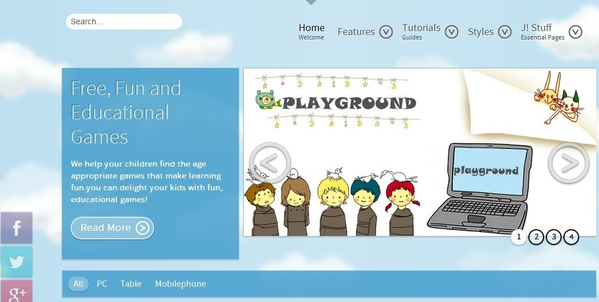
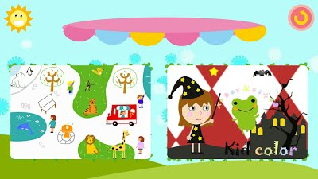
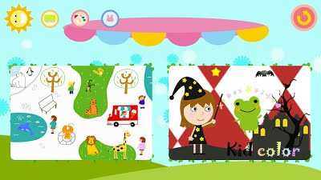
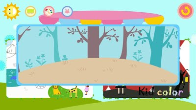
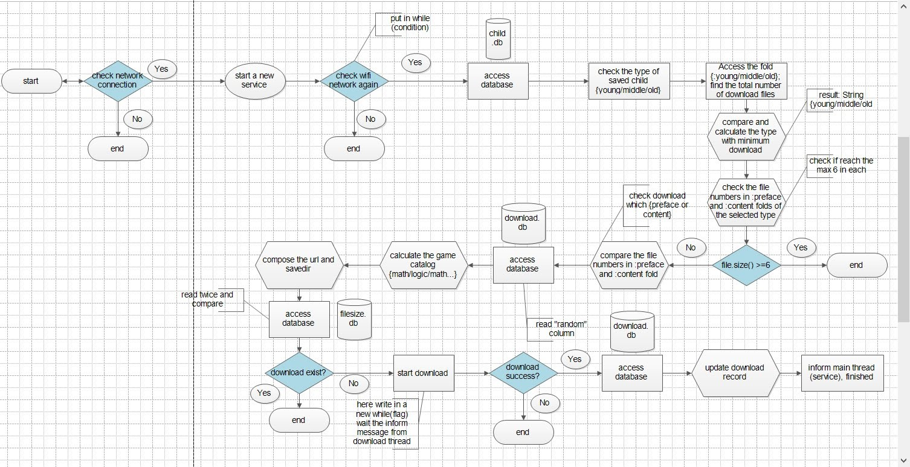

# preschooledu (Smartnini preschool education game platform)
A platform to organize games that can collect data to infer players' strength like imagination, reaction capability, memory etc.

## Platform web

## Android app

## Process flow

